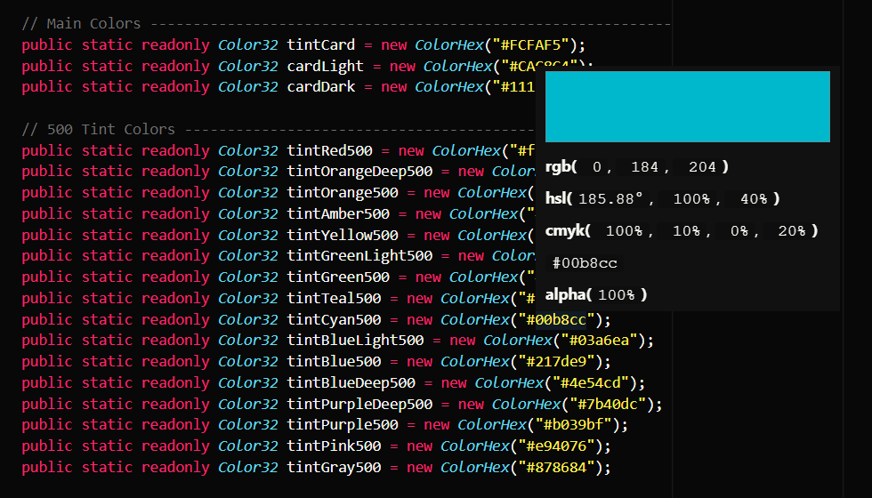

# ColorHex
A simple C# script that allows for creating UnityEngine Color32 variables via a hex code string

## Getting Started
Getting ColorHex into your Unity project is as simple as dropping the [ColorHex.cs](ColorHex.cs) file into your `Assets/Scripts` project folder.

## Usage
Instead of using Color32's constructor which requires you to pass byte values, you can now use the ColorHex constructor to pass in a hex code string. Since ColorHex is designed to be interoperable with Color32, an implementation can look like this:

```cs
public Color32 tintRed500 = new ColorHex("#F14234");
```

## Features
- Reduces development time (and headaches) by letting you use a color code that can be copy-pasted straight from programs like Photoshop
- Works with or without a preceding '#' character
- Supports alpha values (ex. #FFFFFF00)
- Allows some text editor/IDE plugins to preview your color (ex. [Color Info](https://github.com/mattbierner/vscode-color-info) for [Visual Studio Code](https://code.visualstudio.com/)


